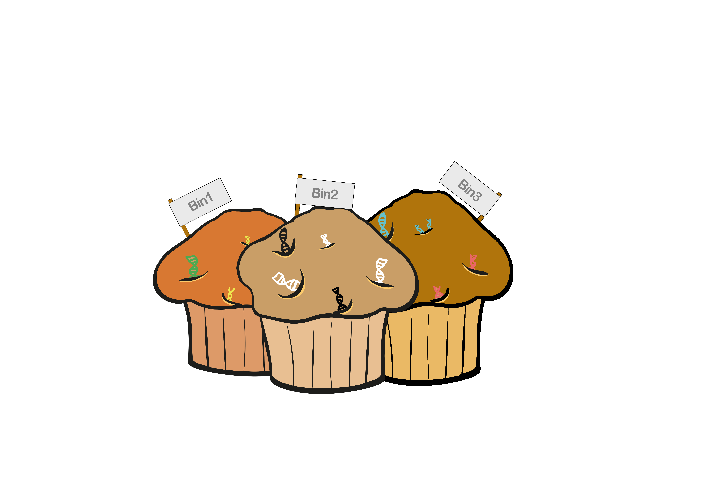

# MUFFIN 
MUFFIN is a hybrid assembly and differential binning workflow for metagenomics, transcriptomics and pathway analysis.

A preprint is available here https://www.biorxiv.org/content/10.1101/2020.02.08.939843v1

## INDEX

1. [Introduction](#introduction)
2. [Figure](#figure) :
    - [Workflow](#the-workflow)
    - [Parser output](#the-parser-output)
3. [Installation](installation.md#installation) :
    - [base installation](installation.md#base-installation)
    - [conda usage](installation.md#for-conda-usage)
    - [gcloud usage](installation.md#for-gcloud-usage)
    - [containers usage](installation.md#for-containers-usage)
    - [software installed locally](installation.md#for-usage-of-software-installed-locally)
4. [Test the pipeline](installation.md#test-the-pipeline)
5. [Manual configuration](config.md#manual-configuration)
6. [Usage](usage/usage.md#usage) :
    - [Automated usage](#automated-usage)
    - [Basic usage](usage/usage.md#basic-usage)
    - [Advanced usage](usage/usage.md#advanced-usage)
7. [Troubleshooting](troubleshooting.md#troubleshooting)
8. [Options](usage/usage.md#options)
9. [Complete help and options](usage/usage.md#complete-help-and-options)
10. [Bibliography](#bibliography)
11. [License](#license)

## Introduction 

MUFFIN aims at being a reproducible pipeline for metagenome assembly
of crossed illumina and nanopore reads.

MUFFIN uses the following software 

| Task | Software | Version | Docker | Image version|
| --- | --- | --- | --- | --- |
| QC illumina | [fastp](https://github.com/OpenGene/fastp) | 0.20.0 | [LINK](https://hub.docker.com/r/nanozoo/fastp) | 0.20.0--78a7c63 |
| QC ont | automated way to discard shortest reads |  |  |  |
|  | [filtlong](https://github.com/rrwick/Filtlong) | 0.2.0 | [LINK](https://hub.docker.com/r/nanozoo/filtlong) | v0.2.0--afa175e |
| metagenomic composition of ont | [sourmash](https://sourmash.readthedocs.io/en/latest/) | 2.0.1 | [LINK](https://hub.docker.com/r/nanozoo/sourmash) | 2.0.1--6970ddc |
| Hybrid assembly | [Meta-spades](http://cab.spbu.ru/software/spades/) | 3.13.1 | [LINK](https://hub.docker.com/r/nanozoo/spades) | 3.13.1--2c2a4c0 |
|  | [unicycler](https://github.com/rrwick/Unicycler) | 0.4.7 | [LINK](https://hub.docker.com/r/nanozoo/unicycler) | 0.4.7-0--c0404e6 |
| Long read assembly | [MetaFlye](https://github.com/fenderglass/Flye) | 2.7 | [LINK](https://hub.docker.com/r/nanozoo/flye) | 2.7--957a1a1 |
| polishing | [racon](https://github.com/lbcb-sci/racon) | 1.4.13 | [LINK](https://hub.docker.com/r/nanozoo/racon) | 1.4.13--bb8a908 |
|  | [medaka](https://github.com/nanoporetech/medaka) | 1.0.3 | [LINK](https://hub.docker.com/r/nanozoo/medaka) | 1.0.3--7c62d67 |
|  | [pilon](https://github.com/broadinstitute/pilon/wiki) | 1.23 | [LINK](https://hub.docker.com/r/nanozoo/pilon) | 1.23--b21026d |
| mapping | [minimap2](https://github.com/lh3/minimap2) | 2.17 | [LINK](https://hub.docker.com/r/nanozoo/minimap2) | 2.17--caba7af |
|  | [bwa](http://bio-bwa.sourceforge.net/) | 0.7.17 | [LINK](https://hub.docker.com/r/nanozoo/pilon) | 1.23--b21026d |
|  | [samtools](http://www.htslib.org/) | 1.9 | [LINK](https://hub.docker.com/r/nanozoo/minimap2) | 2.17--caba7af |
| retrieve reads mapped to contig | [seqtk](https://github.com/lh3/seqtk) | 1.3 | [LINK](https://hub.docker.com/r/nanozoo/seqtk) | 1.3--dc0d16b |
| Binning | [Metabat2](https://bitbucket.org/berkeleylab/metabat/src/master/) | 2.13 | [LINK](https://hub.docker.com/r/nanozoo/metabat2) | 2.13--0e2577e |
|  | [maxbin2](https://sourceforge.net/projects/maxbin2/) | 2.2.7 | [LINK](https://hub.docker.com/r/nanozoo/maxbin2) | 2.2.7--b643a6b |
|  | [concoct](https://github.com/BinPro/CONCOCT) | 1.1.0 | [LINK](https://hub.docker.com/r/nanozoo/concoct) | 1.1.0--03a3888 |
|  | [metawrap](https://github.com/bxlab/metaWRAP) | 1.2.2 | [LINK](https://hub.docker.com/r/nanozoo/metawrap) | 1.2.2--de94241 |
| qc binning | [checkm](https://ecogenomics.github.io/CheckM/) | 1.0.13 | [LINK](https://hub.docker.com/r/nanozoo/nanoplot) | 1.0.13--248242f |
|Taxonomic Classification  | [sourmash](https://sourmash.readthedocs.io/en/latest/) using the [gt-DataBase](https://gtdb.ecogenomic.org/) | 2.0.1 | [LINK](https://hub.docker.com/r/nanozoo/sourmash) | 2.0.1--6970ddc |
|  | [GTDB](https://gtdb.ecogenomic.org/) | version r89 |  |  |
| Annotations (bin and RNA) | [eggNOG](https://github.com/eggnogdb/eggnog-mapper/wiki/eggNOG-mapper-v2) | 2.0.1 | [LINK](https://hub.docker.com/r/nanozoo/eggnog-mapper) | 2.0.1--d5e0c8c |
|  | [eggNOG DB](http://eggnog5.embl.de/#/app/home) | v5.0 |  |  |
| *De novo* transcript and quantification | [Trinity](https://github.com/trinityrnaseq/trinityrnaseq/wiki) | 2.9.1 | [LINK](https://hub.docker.com/r/nanozoo/trinity) | 2.9.1--82fe26c |
|  | [Salmon](https://github.com/COMBINE-lab/salmon) | 0.15.0 | [LINK](https://hub.docker.com/r/nanozoo/trinity) | 2.9.1--82fe26c |

## Figure

### The Workflow

### The parser output

## BIBLIOGRAPHY

BWA: Li H. and Durbin R. (2009) Fast and accurate short read alignment with Burrows-Wheeler Transform. Bioinformatics, 25:1754-60. [PMID: 19451168] 

CheckM: Parks DH, Imelfort M, Skennerton CT, Hugenholtz P, Tyson GW. 2015. CheckM: assessing the quality of microbial genomes recovered from isolates, single cells, and metagenomes. Genome Research, 25: 1043–1055.

Concoct: Johannes Alneberg, Brynjar Smári Bjarnason, Ino de Bruijn, Melanie Schirmer, Joshua Quick, Umer Z Ijaz, Leo Lahti, Nicholas J Loman, Anders F Andersson & Christopher Quince. 2014. Binning metagenomic contigs by coverage and composition. Nature Methods, doi: 10.1038/nmeth.3103 

Fastp: Shifu Chen, Yanqing Zhou, Yaru Chen, Jia Gu; fastp: an ultra-fast all-in-one FASTQ preprocessor, Bioinformatics, Volume 34, Issue 17, 1 September 2018, Pages i884–i890, https://doi.org/10.1093/bioinformatics/bty560

Filtlong: https://github.com/rrwick/Filtlong

Flye: Mikhail Kolmogorov, Jeffrey Yuan, Yu Lin and Pavel Pevzner, "Assembly of Long Error-Prone Reads Using Repeat Graphs", Nature Biotechnology, 2019 doi:10.1038/s41587-019-0072-8

HMMER: http://hmmer.org/ 

Maxbin2: Wu YW, Tang YH, Tringe SG, Simmons BA, and Singer SW, "MaxBin: an automated binning method to recover individual genomes from metagenomes using an expectation-maximization algorithm", Microbiome, 2:26, 2014.

Medaka: https://github.com/nanoporetech/medaka

Metabat2: Kang DD, Froula J, Egan R, Wang Z. MetaBAT, an efficient tool for accurately reconstructing single genomes from complex microbial communities. PeerJ 2015;3:e1165. doi:10.7717/peerj.1165

Metawrap: Uritskiy, G.V., DiRuggiero, J. and Taylor, J. (2018). MetaWRAP—a flexible pipeline for genome-resolved metagenomic data analysis. Microbiome, 6(1). https://doi.org/10.1186/s40168-018-0541-1

Minimap2: Li, H. (2018). Minimap2: pairwise alignment for nucleotide sequences. Bioinformatics, 34:3094-3100. doi:10.1093/bioinformatics/bty191

Pilon: Bruce J. Walker, Thomas Abeel, Terrance Shea, Margaret Priest, Amr Abouelliel, Sharadha Sakthikumar, Christina A. Cuomo, Qiandong Zeng, Jennifer Wortman, Sarah K. Young, Ashlee M. Earl (2014) Pilon: An Integrated Tool for Comprehensive Microbial Variant Detection and Genome Assembly Improvement. PLoS ONE 9(11): e112963. doi:10.1371/journal.pone.0112963

pplacer: Matsen FA, Kodner RB, Armbrust EV. 2010. pplacer: linear time maximum-likelihood and Bayesian phylogenetic placement of sequences onto a fixed reference tree. BMC Bioinformatics 11: doi:10.1186/1471-2105-11-538.

prodigal: Hyatt D, Locascio PF, Hauser LJ, Uberbacher EC. 2012. Gene and translation initiation site prediction in metagenomic sequences. Bioinformatics 28: 2223–2230.

Racon: Vaser R, Sovic I, Nagarajan N, Sikic M. 2017. Fast and accurate de novogenome assembly from long uncorrected reads. Genome Res 27:737–746.https://doi.org/10.1101/gr.214270.116

Samtools: Li H, Handsaker B, Wysoker A, Fennell T, Ruan J, Homer N, Marth G, Abecasis G, Durbin R, and 1000 Genome Project Data Processing Subgroup, The Sequence alignment/map (SAM) format and SAMtools, Bioinformatics (2009) 25(16) 2078-9 [19505943]

Seqtk: https://github.com/lh3/seqtk

Sourmash: Brown et al, (2016), sourmash: a library for MinHash sketching of DNA, Journal of Open Source Software, 1(5), 27, doi:10.21105/joss.00027

Spades:  Lapidus A., Antipov D., Bankevich A., Gurevich A., Korobeynikov A., Nurk S., Prjibelski A., Safonova Y., Vasilinetc I., Pevzner P. A. New Frontiers of Genome Assembly with SPAdes 3.0.	(poster), 2014 

Unicycler: Wick RR, Judd LM, Gorrie CL, Holt KE (2017) Unicycler: Resolving bacterial genome assemblies from short and long sequencing reads. PLoS Comput Biol 13(6): e1005595. https://doi.org/10.1371/journal.pcbi.1005595

## License

Code is [GPL-3.0](LICENSE)

## Contributing

We welcome contributions from the community! See our
[Contributing](CONTRIBUTING.md) guidelines
